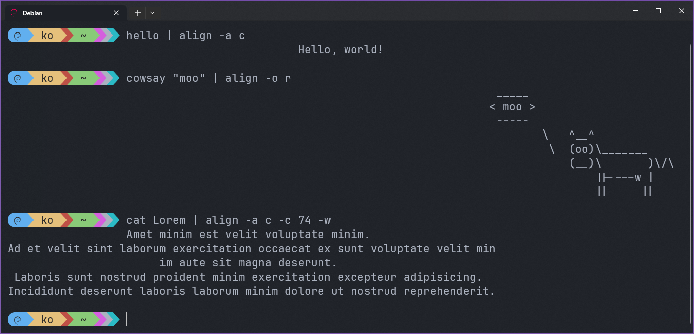

# align: a command line utility for aligning text.

## ⭐ Overview

Aligns text within the terminal (or a specified number of columns).  
The text is treated as a block, and you can align the content within it, or align it within the space.

## 💻 Examples:



## ⌨ Usage

Text is read from stdin (terminal input, pipe in, etc.), formatted according to the options, then written out.


```
Usage: align [OPTIONS]

Options:
  -o, --outer <OUTER>      Where to align the block of text [default: left] [possible values: left, center, right]
  -i, --inner <INNER>      Where to align text inside the block [default: left] [possible values: left, center, right]
  -a, --align <ALIGN>      Shorthand for specifiying both [possible values: left, center, right]
  -c, --columns <COLUMNS>  Number of columns. Takes text's width if 0, terminal's width if unspecified
  -w, --wrap               Wrap the lines of text to fit in the number of columns
  -t, --trim               Trim the spaces around the lines before aligning
  -k, --keep               Keep the spaces on the right in output
  -b, --bias <BIAS>        Offset if line can't be centered perfectly [default: left] [possible values: left, right]
  -h, --help               Print help (see more with '--help')
  -V, --version            Print version
```

* Tip: You can use the command twice to format a block with a specific width, then align it in a bigger space.

### Error: "couldn't get terminal width"

This program uses the [term_size](https://crates.io/crates/term_size) crate to determine the terminal width by inspecting `stdout`, `stdin`, or `stderr`. If none of these streams is a tty (connected to the terminal), the terminal width can't be calculated.

This can happen if you're redirecting all three streams. Example: `echo "test" | align > test.txt 2>&1`, which produces `Error: "couldn't get terminal width"`.

In such a case, you must specify the number of columns yourself, see [Usage](#usage).

## 🙏 Special Thanks

* [clap](https://github.com/clap-rs/clap): Command Line Argument Parser for Rust.
* [term_size](https://github.com/clap-rs/term_size-rs): A Rust library to enable getting terminal sizes and dimensions.
* FOSS and Rust communities 💖.
